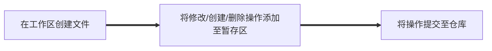

近期做项目用Github比较频繁，简单记录一下Git的主要操作方式，比较复杂的部分就略过了，主要是以使用为目的

## 目录

>版本库的创建
>
>*  Git的安装
>*  版本库的创建
>
>版本库的操作
>
>*  文件操作
>*  版本回退
>*  修改撤销 
>
>远程库连接
>
>* 远程库添加与解除
>* 从远程库克隆
>
>分支管理
>
>* 创建与合并分支
>* 多人协作
>
>标签管理
>
>* 创建标签
>* 操作标签
>

## 版本库的创建

******

### Git的安装

在Ubuntu Linux上使用apt软件包管理工具进行安装

``` bash
sudo apt-get install git
```

在windows上直接进入[Git官网](https://git-scm.com/downloads)下载安装程序，而后按照默认选项安装即可


### 版本库的创建

选择一个合适的位置利用mkdir指令创建一个空目录，而后进入后输入指令

```bash
git init
```

于是该目录就变成了Git可以管理的仓库，细心的读者可以发现当前目录下多了一个`.git`的目录，这个目录是Git来跟踪管理版本库的，没事千万不要手动修改这个目录里面的文件，不然改乱了，就把Git仓库给破坏了。


## 版本库的操作

*******

### 文件操作

在文件操作之前首先明确几个概念

**工作区**

就是电脑中能直接看见的目录


**版本库**

工作区目录中有一个隐藏目录.git。这个是Git的版本库，版本库主要由两个部分组成，stage暂存区和分支区。


 **将文件添加至Git版本库中时，有三个步骤：**

**首先**在工作区创建一个文件Read.txt

```bash
vim/typora Read.txt
```

将文件修改添加至暂存区，在添加至暂存区前，我们首先看一下git的状态

```bash
~/CS61A$ git status
On branch master
Your branch is ahead of 'origin/master' by 1 commit.
  (use "git push" to publish your local commits)

Untracked files:
  (use "git add <file>..." to include in what will be committed)
	Read.txt

nothing added to commit but untracked files present (use "git add" to track)

```

Git清楚的告诉我们，有一个文件出现了，而`Read.txt`还从来没有被添加过，所以它的状态是`Untracked`。

**而后**我们创建文件这次操作添加至暂存区

```bash
git add Read.txt
```

*如果添加的是文件夹可以使用*

```bash
git add vs/*
```

如果想删除文件可以用

````bash
git rm Read.txt
````

再次查看git的状态

```bash
~/CS61A$ git status
On branch master
Your branch is ahead of 'origin/master' by 1 commit.
  (use "git push" to publish your local commits)

Changes to be committed:
  (use "git restore --staged <file>..." to unstage)
	new file:   Read.txt

```

`Changes to be committed`我们发现git已经识别了这个文件，可见这个文件已经被添加到了暂存区。

**最后**我们将文件创建这次操作提交至仓库的master分支（分支的概念后面会讲到）

```bash
git commit Read.txt -m "commit"
```

*如果想提交全部文件的操作可以用*

```bash
git commit -m "commit"
```

这里的-m参数是对这次提交进行文字说明

再次查看git的状态

```bash
~/CS61A$ git status
On branch master
Your branch is ahead of 'origin/master' by 2 commits.
  (use "git push" to publish your local commits)

nothing to commit, working tree clean

```

可见此时暂存区为空，修改已提交至仓库

我们可以将创建文件并提交至仓库的过程用流程图表示



估计很多人都有疑问，为什么这里写的是操作，而不是将文件添加至暂存区，因为Git管理的是修改而不是文件，我们用一个例子来说明这个问题。

首先，我们在Read.txt中添加一段文字`hello me`，而后将这次操作添加到暂存区，我们查看此时的状态

```bash
it status
On branch master
Your branch is ahead of 'origin/master' by 2 commits.
  (use "git push" to publish your local commits)

Changes to be committed:
  (use "git restore --staged <file>..." to unstage)
	modified:   Read.txt

```

可见此次修改已经添加到了暂存区，而后我们再对文件进行修改，增加一行`hello you`，不将此次修改添加至暂存区。

```bash
git status
On branch master
Your branch is ahead of 'origin/master' by 2 commits.
  (use "git push" to publish your local commits)

Changes to be committed:
  (use "git restore --staged <file>..." to unstage)
	modified:   Read.txt

Changes not staged for commit:
  (use "git add <file>..." to update what will be committed)
  (use "git restore <file>..." to discard changes in working directory)
	modified:   Read.txt

```

我们执行提交指令将修改提交至仓库，而后查看git状态

```bash
git status
On branch master
Your branch is ahead of 'origin/master' by 8 commits.
  (use "git push" to publish your local commits)

Changes not staged for commit:
  (use "git add <file>..." to update what will be committed)
  (use "git restore <file>..." to discard changes in working directory)
	modified:   Read.txt


```

我们发现，未添加至暂存区的修改并未提交至仓库，我们查看一下工作区和最新版本库的区别

```bash
~/CS61A$ git diff -- Read.txt
diff --git a/Read.txt b/Read.txt
index 1f8eec4..12ee40e 100644
--- a/Read.txt
+++ b/Read.txt
@@ -1,2 +1,3 @@
 hello world
 hello me
+hello you
```

如果Git管理的是文件本身，那么文件在提交时是什么样，提交的文件就是什么样，然而经过对比发现，版本库的文件和工作区的文件是不一样，我们每次添加到暂存区的是对文件的操作步骤，比如创建删除文件，添加几行，删除几行，由于刚才添加`hello you`这一行文字的修改操作并未添加至暂存区，提交时只提交暂存区有的操作，因此该操作未提交至仓库。


### 版本回退

上面i讲到，Git管理的是修改，如果我们在进行修改提交的过程中，不小心删除了最后一行`hello me` ，而我们又需要这行文字该怎么办呢？

这时候就需要利用版本回退的功能了。

在Git中，我们可以查看每次操作的记录

```bash
~/CS61A$ git log --pretty=oneline
aa03a474011bcb97e9f596d3b5c9a1b517726d05 (HEAD -> master) delete a line
05491fda20edff579daf14f24b7afed61d591842 add a line
a58d42838b1284034c4a9d52f0d2780ad251bda2 a
f67db85d1deeb3d7ca0020a332ac4e07bccf12b0 all
b96112ab41f972a9949e213347d7403dd2f8a03b 1
```

我们要将版本回退到`delete a line`操作前，因此我们使用`reset`指令

```bash
~/CS61A$ git reset --hard HEAD^
HEAD is now at 05491fd add a line
```

这里的HEAD^表示上一个版本，如果上两个版本则为^^,以此类推。

但是问题来了，如果我们现在又想回到`delete a line`版本该怎么办呢？版本已经回退了。

git有一个命令记录了你的每次命令

```bash
~/CS61A$ git reflog
05491fd (HEAD -> master) HEAD@{0}: reset: moving to HEAD^
aa03a47 HEAD@{1}: commit: delete a line
05491fd (HEAD -> master) HEAD@{2}: commit: add a line
```

于是我们就可以利用`aa03a47`这个id来回到原来版本。

```bash
git reset --hard aa03a47
HEAD is now at aa03a47 delete a line
```

于是，版本又回来了。


### 修改撤销

有的时候我们会因为手抖写错代码，比如我们在Read.txt（.sh）文件中添加一行‘rm -rf’，懂点Linux都知道这是个致命操作。

**如果你还没有将这次文件修改提交到暂存区**，那么很简单，直接修改就好了，或者也可以使用指令

```bash
git checkout -- Read.txt
```

工作区的修改就被丢弃了，工作区文件的内容和版本库文件的内容相同。

**如果你已经将文件修改添加到了暂存区**，那么我们需要使用另一个指令

```bash
git reset HEAD Read.txt
```

reset指令不仅可以回退版本，当HEAD不^时，reset指令也可以将暂存区的修改操作移除，而后再利用`checkout`指令同步版本库和工作区内容。

**如果你已经将修改提交到了版本库**，那么按照版本回退的方式进行即可

```
git reset --hard HEAD^
```

如果你已经将版本库内的内容推送到远程库，比如Github，那就只能听天由命了，谁运行，谁遭殃。


## 远程库连接

************

### 远程库添加/解除

首先，登陆GitHub，然后，在右上角找到“Create a new repo”按钮，创建一个新的仓库

（图借的廖雪峰大L的）：


在Repository name填入`Read`，其他保持默认设置，点击“Create repository”按钮，就成功地创建了一个新的Git仓库：


而后，我们在本地运行命令

```bash
 git remote add origin git@github.com:xxxx/Read.git
```

xxx处为你自己的Github账户名，就可以将本地的版本库和远程的库连接起来了。

将本地库所有内容推送至Github远程库的master分支。

````
git push （-u） origin master
````

加上了`-u`参数，Git不但会把本地的`master`分支内容推送的远程新的`master`分支，还会把本地的`master`分支和远程的`master`分支关联起来，在以后的推送或者拉取时就可以简化命令，不许需要加入-u参数。


**SSH警告**

当你第一次使用Git的`clone`或者`push`命令连接GitHub时，会得到一个警告：

```
The authenticity of host 'github.com (xx.xx.xx.xx)' can't be established.
RSA key fingerprint is xx.xx.xx.xx.xx.
Are you sure you want to continue connecting (yes/no)?
```

这是因为Git使用SSH连接，而SSH连接在第一次验证GitHub服务器的Key时，需要你确认GitHub的Key的指纹信息是否真的来自GitHub的服务器，输入`yes`回车即可。

Git会输出一个警告，告诉你已经把GitHub的Key添加到本机的一个信任列表里了：

```
Warning: Permanently added 'github.com' (RSA) to the list of known hosts.
```

这个警告只会出现一次，后面的操作就不会有任何警告了。

如果你实在担心有人冒充GitHub服务器，输入`yes`前可以对照[GitHub的RSA Key的指纹信息](https://help.github.com/articles/what-are-github-s-ssh-key-fingerprints/)是否与SSH连接给出的一致。


**解除远程库与本地库的关联关系**

如果我们需要解除本地库与远程库的关联关系，可以使用命令

```bash
git remote rm origin
```


### 远程库克隆

我们有时需要把远程库从Github克隆下来，为了借鉴代码或是进行分布式工作，使用以下指令将远程库克隆至本地

```bash
git clone git@github.com:xxx/Read.git
```


## 分支管理 

*********

### 创建与合并分支

在[版本回退](https://www.liaoxuefeng.com/wiki/896043488029600/897013573512192)里，你已经知道，每次提交，Git都把它们串成一条时间线，这条时间线就是一个分支。截止到目前，只有一条时间线，在Git里，这个分支叫主分支，即`master`分支。`HEAD`严格来说不是指向提交，而是指向`master`，`master`才是指向提交的，所以，`HEAD`指向的就是当前分支。


当我们创建新的分支，例如`dev`时，Git新建了一个指针叫`dev`，指向`master`相同的提交，再把`HEAD`指向`dev`，就表示当前分支在`dev`上


我们建立一个新分支`dev`并切换至新分支

```bash
git checkout -b dev    /   git switch -c dev
```

*如果切换至已有分支则*

```bash
git checkout dev    /    git switch dev
```

如果只是创建分支

```bash
git branch dev
```

从现在开始，对工作区的修改和提交就是针对`dev`分支了，比如新提交一次后，`dev`指针往前移动一步，而`master`指针不变：


假如我们在`dev`上的工作完成了，就可以把`dev`合并到`master`上。Git怎么合并呢？最简单的方法，就是直接把`master`指向`dev`的当前提交，就完成了合并：


我们切换至主分支，而后将dev分支合并至主分支master

```
git checkout master
git merge dev
```

而后我们可以保留分支，也可以删除分支，如果删除分支

```
git branch -d dev
```


### 多人协作

在实际开发中，我们应该按照几个基本原则进行分支管理：

首先，`master`分支应该是非常稳定的，也就是仅用来发布新版本，平时不能在上面干活；

那在哪干活呢？干活都在`dev`分支上，也就是说，`dev`分支是不稳定的，到某个时候，比如1.0版本发布时，再把`dev`分支合并到`master`上，在`master`分支发布1.0版本；

你和你的小伙伴们每个人都在`dev`分支上干活，每个人都有自己的分支，时不时地往`dev`分支上合并就可以了。

所以，团队合作的分支看起来就像这样：


**远程库克隆**

团队合作的过程中首先要将远程库克隆至本地，具体方式见前文远程库克隆一节

完成克隆后，Git自动把本地的master分支和远程的master分支对应起来了，默认远程仓库的名称为origin

查看远程库的信息

```bash
~/CS61A$ git remote -v
origin	git@github.com:x/CS61A.git (fetch)
origin	git@github.com:x/CS61A.git (push)
```

上面显示了可以抓取和推送的`origin`的地址。如果没有推送权限，就看不到push的地址。


**分支的推送**

分支的推送有很多种模式，这里只介绍最简单的模式，假设，我们已经将远程库的master分支克隆到了本地，而后我们创建了一个新的分支dev，在新的分支进行工作，工作完毕后我们将dev分支合并至master分支，而后使用

```
git push origin master
```

就将该分支推送到了远程库


**分支的抓取**

在多人协作时可能会出现一些问题，比如有一天，你的小伙伴已经向origin/master分支推送了他的提交，而你碰巧也对同样的文件进行了修改，并试图推送，这时候你会发现，git提示推送失败，因为你的小伙伴的最新提交和你的提交有冲突。

因此我们要在推送前先将master最新情况从远程抓下来，然后在本地进行合并和解决冲突。

解决冲突的方法如下

我们知道当我们把远程的master分支抓取下来后，我们本地的dev分支和远程pull下来的master分支存在冲突


这种情况下，Git无法执行“快速合并”，只能试图把各自的修改合并起来，但这种合并会有冲突，我们查看 一下git的状态

```bash
$ git status
On branch master
Your branch is ahead of 'origin/master' by 2 commits.
  (use "git push" to publish your local commits)

You have unmerged paths.
  (fix conflicts and run "git commit")
  (use "git merge --abort" to abort the merge)

Unmerged paths:
  (use "git add <file>..." to mark resolution)

	both modified:   Read.txt

no changes added to commit (use "git add" and/or "git commit -a")

```

Git告诉我们，Read.txt文件存在冲突，我们可以直接查看文件内容

```txt
Git is a distributed version control system.
Git is free software distributed under the GPL.
Git has a mutable index called stage.
Git tracks changes of files.
<<<<<<< HEAD
Creating a new branch is quick & simple.
=======
Creating a new branch is quick AND simple.
>>>>>>> dev
```

Git用`<<<<<<<`，`=======`，`>>>>>>>`标记出不同分支的内容，我们修改如下后保存：

```
Creating a new branch is quick and simple.
```

```
Creating a new branch is quick and simple.
```

再提交修改给master分支

```bash
$ git add readme.txt 
$ git commit -m "conflict fixed"
[master cf810e4] conflict fixed
```

Git告诉我们冲突被解决了，于是我们将dev分支合并至master，而后执行push

```bash
git push origin master
Counting objects: 6, done.
Delta compression using up to 4 threads.
Compressing objects: 100% (4/4), done.
Writing objects: 100% (6/6), 621 bytes | 621.00 KiB/s, done.
Total 6 (delta 0), reused 0 (delta 0)
To github.com:x/Read.git
   7a5e5dd..57c53ab  master -> master
```

成功。


## 标签管理

为什么需要标签？

Git有commit，为什么还要引入tag？

“请把上周一的那个版本打包发布，commit号是6a5819e...”

“一串乱七八糟的数字不好找！”

如果换一个办法：

“请把上周一的那个版本打包发布，版本号是v1.2”

“好的，按照tag v1.2查找commit就行！”

所以，tag就是一个让人容易记住的有意义的名字，它跟某个commit绑在一起。

### 创建标签

在Git中打标签非常简单，首先，切换到需要打标签的分支上，而后敲击tag就可以打一个标签

```bash
git tag v1.0
```

利用`git tag`查看所有标签

```bash
$ git tag
v1.0
v2.0
v2.1
```

如果要对历史commit打标签，那就通过git log找到commit号

```bash
git tag v0.9 f287d34
```

查看每个标签的信息

```bash
$ git show v0.9
commit f52c63349bc3c1593499807e5c8e972b82c8f286 (tag: v0.9)
Author: Michael Liao <askxuefeng@gmail.com>
Date:   Fri May 18 21:56:54 2018 +0800

    add merge

diff --git a/readme.txt b/readme.txt
...
```

然后按照版本回退一节的方法使用`reset`指令回退至对应版本打包即可。

注意，标签总是和某个commit挂钩。如果这个commit既出现在master分支，又出现在dev分支，那么在这两个分支上都可以看到这个标签。


### 操作标签

如果标签打错了，也可以删除：

```bash
$ git tag -d v0.1
Deleted tag 'v0.1' (was f15b0dd)
```

因为创建的标签都只存储在本地，不会自动推送到远程。所以，打错的标签可以在本地安全删除。如果要推送某个标签到远程，使用命令`git push origin <tagname>`，或使用`git push origin --tags`推送所有标签。

如果要删除远程标签则先从本地删除标签，而后向远程同步删除指令

```bash
$ git push origin :refs/tags/v0.9
To github.com:x/Read.gi0t
 - [deleted]         v0.9
```


## 参考

1.[菜鸟教程Git](https://www.runoob.com/git/git-tutorial.html)

2.[廖雪峰的Git教程](https://www.liaoxuefeng.com/wiki/896043488029600)

3.[Git官方网站](https://git-scm.com/)

